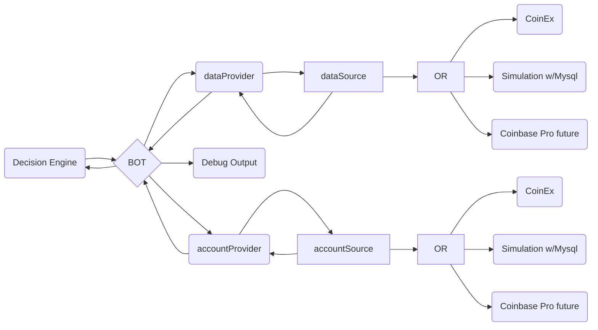

#ReadMe

## MySql Database setup:

install mariaDb ( aka mysql )

`sudo apt-get install mariadb-server`

open mysql:

`sudo mysql -uroot -p`

Create a new database: ( Make sure this matches what is in credentials.py )
`CREATE DATABASE <dbName>;`

Now, create the new user:
`CREATE USER '<dbUser>'@'localhost' IDENTIFIED BY '<dbPassword>';`
Then, allow this new user to do anything on the database we just created:
`GRANT ALL PRIVILEGES ON <dbName>.* TO '<dbUser>'@'localhost';`
Finally, reload the permissions with:
`FLUSH PRIVILEGES;`

Add db credentials file for backups credentials
`nano .my.cnf`
set content:
`[mysqldump]
user=<dbUser>
password=<dbPassword>`

Run to import from backup
`mysql -u <dbUser> -p < dbBackup.sql.gz`
Or Run to import from Schema ( empty )
`mysql -u <dbUser> -p < MrBot-Schema.sql`
Either command will ask for your <dbPassword>

## python requirements:

`sudo apt-get install python3-pip screen redis`

`pip3 install mariadb pytz redis numpy plotext`

# Necessary Diagram

