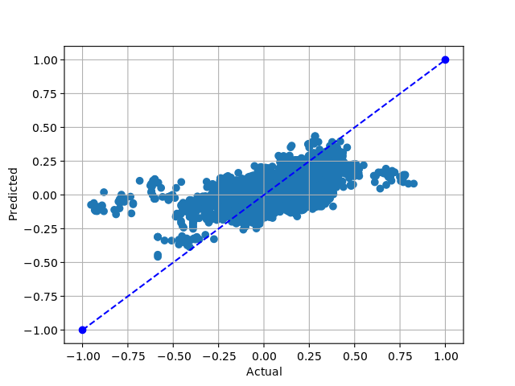
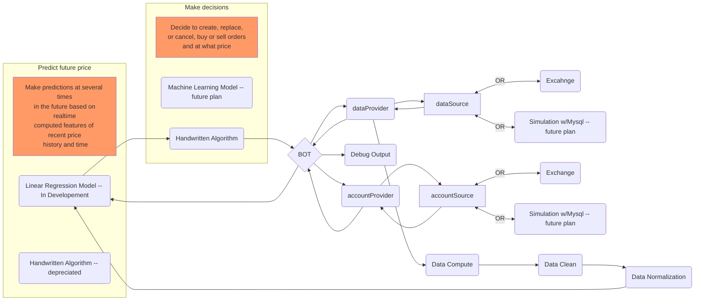

# ReadMe
## Summary:
The goal of this project is to get hands on experience collecting data from a real world source and to build and train several models to have predictive power in the space of said data. 

## Project History (In reverse order / order of importance):

#### NOVEMBER 2022 - Turn off data collection and focus on model building:
Implemented handwritten gradient decent model using numpy.  Code was originally from work in Andrew Ng's Machine learning class on Coursera.  After the biggest milestone of the project, training a model, rewriting the data preparation was a must in order to be able to quickly iterate computed features, data cleaning and data normalizing techniques and be able to get to rebuilding and measuring improvements in the model performance.

Additional computed features were added converting time into time of day, day of week and day of year, each of which has 2 features, one with a sin wave and one with a cos wave.  All price related features had the price of the last trade in each time box subtracted from it, making them to describe the positive or negative movement for each feature vs the actual prices related to that time in the dataset.

SKLearn normalizer was introduced to normalize all records, being sure to keep the positive values positive and the negative values negative post normalization.

The first several training attempts had an r2 score of 1.0, initial excitement at raining a first model quickly became dread as something must be wrong, upon investigation the Y vector was mapped wrong.

SKlearn's LinearRegression was introduced and it still agreed with the the r2 score of 1.0.  Better data management was a must, pandas dataFrame was introduced and took over reading and writing to MySQL tables, this meant there was no more long strings of column names as an easy place for errors to creep in.

Throughout this process the code was all written with future production in mind.  All the computations and model describing was separate from the MySQL data source so that it can easily be applied to real time data if/when the model is ready to go back into production making trades with the exchange.  In addition code to reverse engineer predicted cleaned and normalized result back into an actual USD to BTC price was added.

At this point visualizing data was necessary to start seeing the model at work.  The first graph was the actual results against the predicted results shown below. Noting the blue dotted line as "perfect prediction" it can be seem by the shape of the scatter plot that the model has some predictive ability in that the blob slopes up a little on the right and and slopes down a little on the left.  One apparent problem in the result was that there were essentially no price predictions above 0.5 nor below -0.5.  In the next iteration of data cleaning and normalizing leveraging pandas outliers needed to be removed or capped prior to normalization.  Measuring these results one could postulate that if all the dots were simply in the correct quadrants, upper right and lower left then the model would at least be confidently predicting the right direction of the future price even if the magnitude of the movement might be wrong.   Any dots in the upper left quadrant and the lower right quadrant would be extremely detrimental to my projects overall goal.



Further efforts were made to remove loops in feature computation using numpy, adding 4x to the critical speed of the first few steps in the data preparation. 

10 days with loops -> 3 days with loops removed -> 1 day with 3 workers -> 1 day with 1 worker and threaded csv output instead of mysql.

Current work is on visualizing every feature and visualizing data outlier cleanup and checking for any smells in the calculated data.

#### SEPTEMBER 2021 - Refactor "production":  v1_code
Rewriting live production code as classes.  Making code readable and iterate-able.  Started a feature set to simulate an exchange to train the 2nd Model in the project which would take in the first model's predictions and it's output would be a decision of what to tell the exchange namely: wait, place limit order at price X or remove current order.

#### APRIL 2021 - Collect data & try hand written algorithm: v0_code
A python script was run from April 2021 to November 2022 connecting from an exchange via API with python.  It collected and saved every trade that happened on the exchange.

A hand written algorithm was written to predict the price.  A set of ~150 computed features were created as inputs for this algorithm.  These features were mostly time boxes computing the average, low, high, start and end prices, the percent and real change in price and the volume of trade in several time boxes.

This method of trading was almost successful in that it could trade for a positive gain most of the time, however on a longer time horizon it could not consistently trade in such a way that the overall value of the account rose.  It took me a while to compute the proper value change over time in part because the exchange I used had a 3rd currency used to pay it's transaction fees, so I had automated the occasional buying of that currency as well, and eventually created a conversion of all 3 currencies in the account to USD available at all times.

In real time I only computed the ~150 parameter for the most recent trade each time I queried the exchange api for trade data.  This created a scenario where I needed to create another script that would run the background and computer the additional parameters for every trade in between each "latest trade".  I also created a similar script that would run in the background and computer and store the prediction targets at various points "in the future" from the trade in each record.

This code was very much proof of concept and in hindsight, way too much time was trying to make my handwritten algorithm perform better.  Data collection should have started and then focus should have quickly moved to worked on data pipelines and preparation for model building as the dataset grew.

#### Possible future steps:
1. Create an exchange simulator and train a 2nd algorithm to decided what actions to take based on the predicted price points of the price prediction model.  The model would predict 2 discrete actions and a price to take action at, wait or place/update  buy / sell at price. 

## Necessary Diagram

