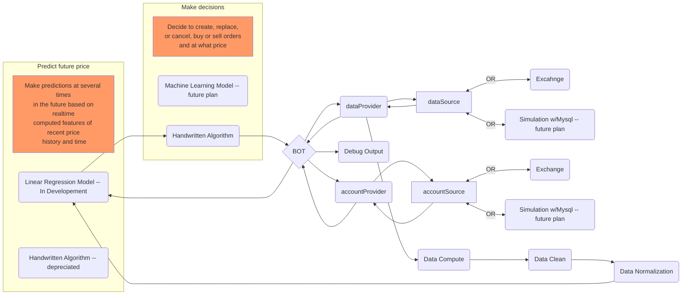

# ReadMe
## Summary:
The goal of this project is to get hands on experience collecting data from a real world source and to build and train several models to have predictive power in the space of said data. 

## Project History:

1. Collect data & Try hand written algorithm
	I ran a python script 24/7 from March 2021 to November 2022 connecting to an exchange via API with python.  It collected every trade that happened on the exchange I used for the bot.
	I also created a hand written algorithm that would predict the price and has that prediction on ~150 computed parameters storing the average, low, high, start and end prices, the percent and real change in price and the volume of trade in that time box.
	This method of trading was almost successful in that it could trade for a positive gain most of the time, however on a long timer horizon it could not consistently trade in such a way that the overall value of the account rose.  It took me a while to computer the proper value change over time in part because the exchange I used had a 3rd currency used to pay it's transaction fees, so I had automated the occasion al buying of that currency as well, and eventually created a conversion of all 3 currencies in the account to USD available at all times.
	In real time I only computed the ~150 parameter for the most recent trade each time I queried the exchange api for trade data.  This created a scenario where I needed to create another script that would run the background and computer the additional parameters for every trade in between each "latest trade".  I also created a similar script that would run in the background and computer and store the prediction targets at various points "in the future" from the trade in each record.
2. Prep data for modeling
	I created a new table and some additional computed features converting time into time of day, day of week and day of year, each of which has 2 features, one with a sin wave and one with a cos wave.  I also subtracted the price of the record from all the price related features essentially making them price neutral and instead describing the real positive or negative movement for each feature.
	I also used and SKLearn normalizer to normalize all my records, being sure to keep the positive values positive and the negative values negative post normalization.
3. Train model
1st pass at training had r2 score of 1.0, my initial excitement quickly became dread as I realized something must be wrong, sure enough I had mapped the  Y vector in my data wrong.

I trained this data with a raw numpy gradient decent and with SKlearn's LinearRegression.  Both agreed on the r2 score of 1.0.  So I went back and corrected my data.  ~0.25

I also developed code to reverse engineer my predicted cleaned and normalized result back into an actual USD to BTC price.
I graphed the actual results against the predicted results ( noting the blue dotted line as "perfect prediction" and while I see that the model has some predictive ability in that the blob slopes up a little on the right and and slopes down a little on the left.  I also thought I could do better.  My next approach was to remove outliers prior to normalization.  I also thought that the model only predicting prices above -0.5 and below 0.5 was something that I should be able to improve.

I also noted that any dots in the upper left quadrant and the lower right quadrant would be extremely detrimental to my projects overall goal.



4. Verify model accuracy / usefulness in real time trading
5. Implement trained model into real time trading

Possible next steps:
1. Create an exchange simulator and train a 2nd algorithm to decided what actions to take based on the predicted price points of the price prediction model.  The model would predict 2 discrete actions and a price to take action at, wait or place/update  buy / sell at price. 

## MySql Database setup:

install mariaDb ( aka mysql )

`sudo apt-get install mariadb-server`

open mysql:

`sudo mysql -uroot -p`

Create a new database: ( Make sure this matches what is in credentials.py )
`CREATE DATABASE <dbName>;`

Now, create the new user:
`CREATE USER '<dbUser>'@'localhost' IDENTIFIED BY '<dbPassword>';`
Then, allow this new user to do anything on the database we just created:
`GRANT ALL PRIVILEGES ON <dbName>.* TO '<dbUser>'@'localhost';`
Finally, reload the permissions with:
`FLUSH PRIVILEGES;`

Add db credentials file for backups credentials
`nano .my.cnf`
set content:
`[mysqldump]
user=<dbUser>
password=<dbPassword>`

Run to import from backup
`mysql -u <dbUser> -p < dbBackup.sql.gz`
Or Run to import from Schema ( empty )
`mysql -u <dbUser> -p < MrBot-Schema.sql`
Either command will ask for your <dbPassword>

## python requirements:

`sudo apt-get install python3-pip screen redis`

`pip3 install mariadb pytz redis numpy plotext`

# Necessary Diagram

Something Under Chart
Something Under Chart
Something Under Chart
Something Under Chart
Something Under Chart
Something Under Chart
Something Under Chart
Something Under Chart
Something Under Chart
Something Under Chart
Something Under Chart
Something Under Chart
Something Under Chart
Something Under Chart
Something Under Chart
Something Under Chart
Something Under Chart
Something Under Chart

